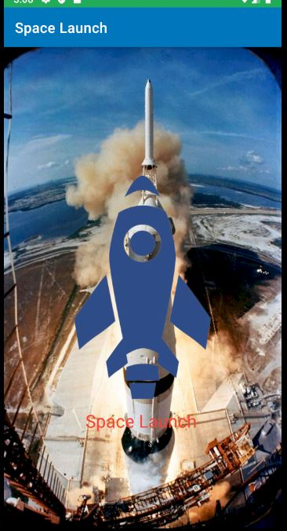
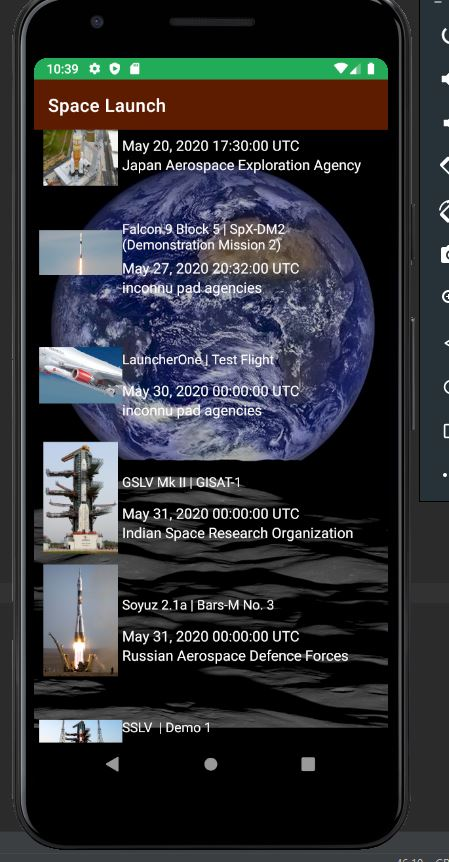
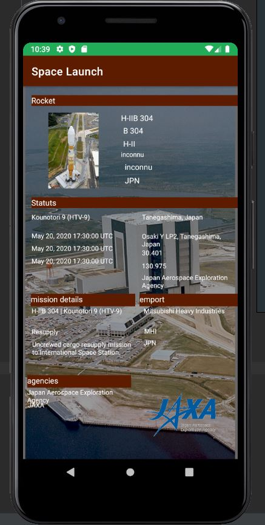
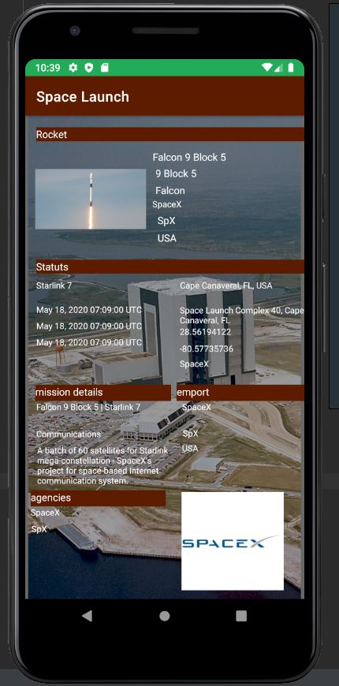
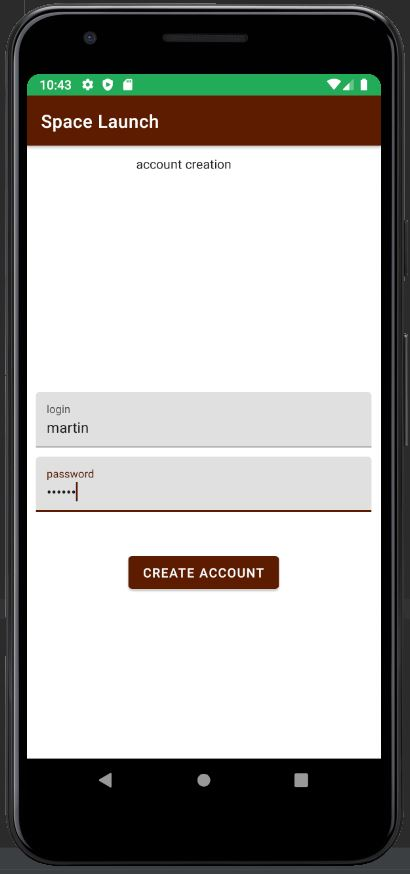
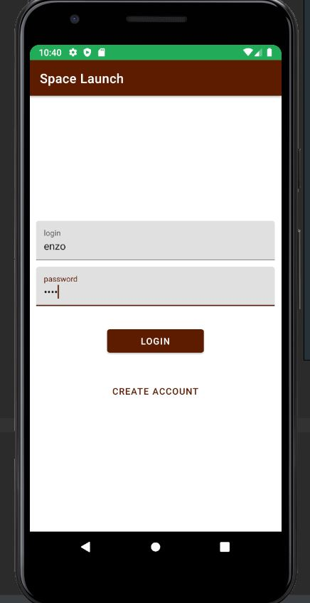

# Androide4A

## Presentation
application afficahnt les prochain decollage de fusée prévu avec l'heure de decollage , les information sur la fusée et sa mission, ainsi que
localisation du pad de tire et de l'agence acteur du tire

## Explication d'utilisation
### Splash Screen
 

  

ici, la splash screen attend 1 seconde avant de demarrer l'application, juste pour la cosmétique de l'application

### Utilisation de la liste des fusée

  screen de la liste des decollage a venir
  

  

  

pour ouvrir la page detail il faut appuyer sur l'image de la Fusée

ce qui permet d'afficher des donnée complémentaire contenu dans notre fichier , qui detail le type de fusée , l'agence de construction, sa mission, la localisation du pas de tir , l'agence de se pas de tire , la mission de l'emport l'agence a qui appartient l'emport , et l'agence gérant le lancement 

pour faire retour , on utilise le retour du portable

 
 #### Utilisation de page de login
 

   

 cette page permet de cree un nouvelle user pour ce connecte a l'appli (exemple login = martin , password = martin)
 

   

 la page permet de se connecter a l'appli dans notre exemple ( login = enzo , password = enzo)
 
### Icone de l'application
 

   

