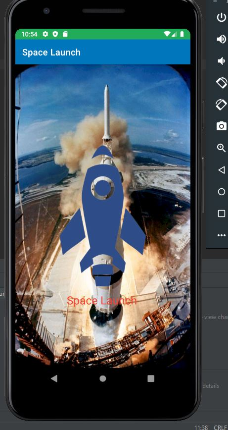

# Androide4A

## Presentation
application afficahnt les prochain decollage de fusée prévu avec l'heure de decollage , les information sur la fusée et sa mission, ainsi que
localisation du pad de tire et de l'agence acteur du tire

## Explication d'utilisation
### Splash Screen
 

  

ici, le splash screen attend 1 seconde avant de demarrer l'application, juste pour la cosmétique de l'application

